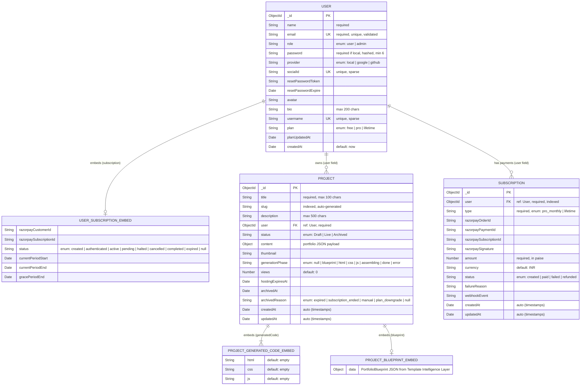

# Entity-Relationship Diagram — AI Portfolio Generator

> **Database**: MongoDB &nbsp;|&nbsp; **ODM**: Mongoose &nbsp;|&nbsp; **Last Updated**: June 2026

---

## ER Diagram

---

## Relationship Summary

| Relationship | Type | Description |
|---|---|---|
| **User → Project** | One-to-Many | A user can own many portfolio projects. `Project.user` references `User._id`. |
| **User → Subscription** | One-to-Many | A user can have many payment/subscription records. `Subscription.user` references `User._id`. |
| **User ↔ Subscription Embed** | Embedded (1:1) | Each user has an embedded `subscription` sub-document tracking their active Razorpay subscription state. |
| **Project ↔ Generated Code** | Embedded (1:1) | Each project embeds a `generatedCode` sub-document with `html`, `css`, and `js` fields. |
| **Project ↔ Blueprint** | Embedded (1:1) | Each project optionally embeds a `blueprint` sub-document with the AI-generated portfolio blueprint JSON. |

---

## Collection Details

### 🧑‍💻 User

| Field | Type | Constraints |
|---|---|---|
| `_id` | ObjectId | Primary Key (auto) |
| `name` | String | **Required** |
| `email` | String | **Required**, Unique, Regex validated |
| `role` | String | `user` \| `admin` — default `user` |
| `password` | String | Required if `provider === 'local'`, min 6, bcrypt hashed, `select: false` |
| `provider` | String | `local` \| `google` \| `github` — default `local` |
| `socialId` | String | Unique (sparse) — for OAuth users |
| `resetPasswordToken` | String | — |
| `resetPasswordExpire` | Date | — |
| `avatar` | String | Default `""` |
| `bio` | String | Max 200 chars |
| `username` | String | Unique (sparse) |
| `plan` | String | `free` \| `pro` \| `lifetime` — default `free` |
| `planUpdatedAt` | Date | — |
| `subscription` | **Embedded** | See sub-document below |
| `createdAt` | Date | Default `Date.now` |

**Embedded: `subscription`**

| Field | Type | Constraints |
|---|---|---|
| `razorpayCustomerId` | String | — |
| `razorpaySubscriptionId` | String | — |
| `status` | String | `created` \| `authenticated` \| `active` \| `pending` \| `halted` \| `cancelled` \| `completed` \| `expired` \| `null` |
| `currentPeriodStart` | Date | — |
| `currentPeriodEnd` | Date | — |
| `gracePeriodEnd` | Date | — |

**Hooks & Methods:**
- `pre('save')` — Hashes password with bcrypt (salt rounds: 10) if modified
- `getSignedJwtToken()` — Returns a signed JWT
- `matchPassword(enteredPassword)` — Compares bcrypt hashes

---

### 📁 Project

| Field | Type | Constraints |
|---|---|---|
| `_id` | ObjectId | Primary Key (auto) |
| `title` | String | **Required**, trimmed, max 100 chars |
| `slug` | String | Indexed, auto-generated from title |
| `description` | String | Max 500 chars |
| `user` | ObjectId | **Required**, `ref: 'User'` |
| `status` | String | `Draft` \| `Live` \| `Archived` — default `Draft` |
| `content` | Object | Stores structured portfolio JSON |
| `generatedCode` | **Embedded** | See sub-document below |
| `blueprint` | Object | AI-generated PortfolioBlueprint JSON |
| `thumbnail` | String | Default `""` |
| `generationPhase` | String | Pipeline tracker: `null` → `blueprint` → `html` → `css` → `js` → `assembling` → `done` \| `error` |
| `views` | Number | Default `0` |
| `hostingExpiresAt` | Date | — |
| `archivedAt` | Date | — |
| `archivedReason` | String | `expired` \| `subscription_ended` \| `manual` \| `plan_downgrade` \| `null` |
| `createdAt` | Date | Auto (Mongoose `timestamps`) |
| `updatedAt` | Date | Auto (Mongoose `timestamps`) |

**Embedded: `generatedCode`**

| Field | Type | Constraints |
|---|---|---|
| `html` | String | Default `""` |
| `css` | String | Default `""` |
| `js` | String | Default `""` |

**Hooks:**
- `pre('save')` — Auto-generates `slug` from `title` (lowercased, sanitized, with random suffix)

---

### 💳 Subscription

| Field | Type | Constraints |
|---|---|---|
| `_id` | ObjectId | Primary Key (auto) |
| `user` | ObjectId | **Required**, `ref: 'User'`, Indexed |
| `type` | String | **Required** — `pro_monthly` \| `lifetime` |
| `razorpayOrderId` | String | — |
| `razorpayPaymentId` | String | — |
| `razorpaySubscriptionId` | String | — |
| `razorpaySignature` | String | — |
| `amount` | Number | **Required** — stored in paise (e.g. 19900 = ₹199) |
| `currency` | String | Default `INR` |
| `status` | String | `created` \| `paid` \| `failed` \| `refunded` — default `created` |
| `failureReason` | String | — |
| `webhookEvent` | String | — |
| `createdAt` | Date | Auto (Mongoose `timestamps`) |
| `updatedAt` | Date | Auto (Mongoose `timestamps`) |

---

## Index Summary

| Collection | Field(s) | Type |
|---|---|---|
| User | `email` | Unique |
| User | `socialId` | Unique (sparse) |
| User | `username` | Unique (sparse) |
| Project | `slug` | Index |
| Subscription | `user` | Index |
