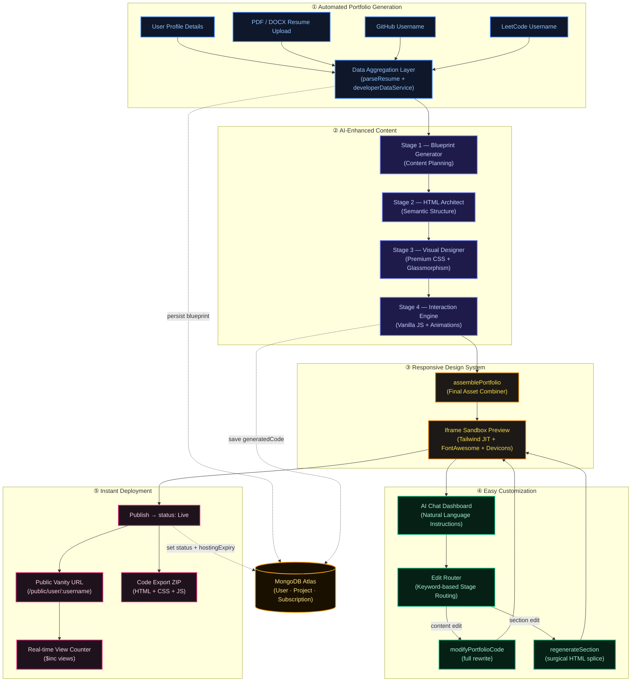
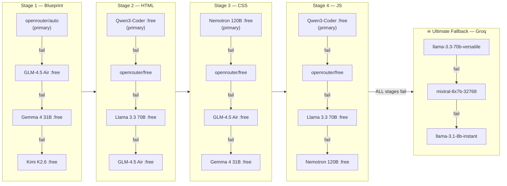
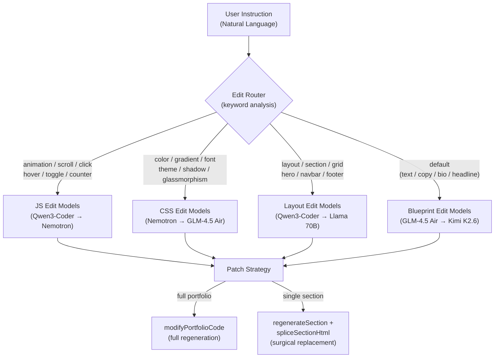
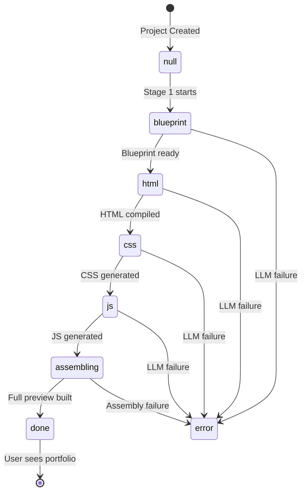
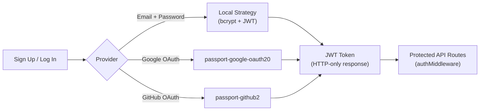

<div align="center">

# ⚡ Profilio

### *Build Your Own Identity — AI-Powered Portfolio Generation at Machine Speed*

[](https://github.com/dear-asutosh/ai-portfolio-generator)
[](https://github.com/dear-asutosh/ai-portfolio-generator)
[](https://github.com/dear-asutosh/ai-portfolio-generator)
[](https://www.asutoshsahoo.co.in)

<br/>

> **Profilio** is a full-stack, AI-orchestrated portfolio generator that transforms a developer's raw experience — resume, GitHub, LeetCode — into a stunning, production-ready personal website in under 60 seconds.

<br/>

---

</div>

## 📐 Architecture Overview

Profilio is a full-stack **MERN** application with a 4-stage AI orchestration pipeline at its core. The backend is deployed on **Vercel (Serverless)** with **MongoDB Atlas** as its data layer. The frontend is a **React 19 + Vite** SPA styled with **Tailwind CSS**.

```
┌─────────────────────────────────────────────────────────────────────┐
│                        CLIENT (React 19 + Vite)                     │
│        Landing → Auth → Dashboard → Editor → Live Portfolio         │
└────────────────────────────┬────────────────────────────────────────┘
                             │ REST API
┌────────────────────────────▼────────────────────────────────────────┐
│                    SERVER (Node.js + Express 5)                      │
│                                                                      │
│   ┌──────────┐  ┌──────────────┐  ┌──────────────┐  ┌──────────┐  │
│   │  Auth    │  │   AI Engine  │  │  Portfolio   │  │ Payments │  │
│   │ (Passport│  │ (4-Stage     │  │  Lifecycle   │  │(Razorpay)│  │
│   │  JWT)    │  │  Pipeline)   │  │  & Hosting   │  │          │  │
│   └──────────┘  └──────────────┘  └──────────────┘  └──────────┘  │
│                                                                      │
│            MongoDB Atlas  ·  Cloudinary  ·  Vercel                  │
└─────────────────────────────────────────────────────────────────────┘
```

---

## ✨ Core Features

| Feature | Description |
| :--- | :--- |
| 🤖 **AI Orchestration** | 4-stage LLM pipeline with automatic model fallback & health circuit-breaker |
| 📄 **Resume Parsing** | Extracts structured data from PDF/DOCX resumes using `pdf-parse` + `mammoth` |
| 🐙 **GitHub Integration** | Fetches live repo stats, stars, and forks via the GitHub REST API |
| 🧩 **LeetCode Integration** | Pulls real-time solve counts and acceptance rates |
| 🎨 **Responsive Design** | Generated portfolios use Tailwind JIT, glassmorphism, and custom animations |
| 🛠️ **AI Customization** | Conversational AI editor — edit content, layout, design, and JS interactions |
| 🚀 **Instant Deployment** | Publish with one click to a public vanity URL (`profilio.app/u/username`) |
| 📦 **Code Export** | Download clean, dependency-free HTML + CSS + JS source files (Pro/Lifetime) |
| 📊 **Analytics** | Real-time view counter on live portfolios |
| 💳 **Subscription Plans** | Free / Pro / Lifetime tiers enforced by plan middleware |

---

## 🔄 End-to-End Product Workflow

The following diagram traces the complete user journey from sign-up to a live portfolio:



---

## 🤖 AI Orchestration — The 4-Stage Pipeline

The heart of Profilio is a **sequential, multi-model LLM pipeline** where each stage is handled by models specifically chosen for that task. Every stage has a **fallback chain** with automatic circuit-breaking.



### Model Selection Rationale

| Stage | Primary Model | Why |
| :--- | :--- | :--- |
| **Blueprint** | `openrouter/auto` → `GLM-4.5 Air` | Best for structured JSON reasoning and content planning. `auto` avoids single-model 429 rate limits. |
| **HTML** | `qwen/qwen3-coder` | Superior Tailwind class accuracy and semantic HTML generation. Never uses `auto` — quality consistency is non-negotiable here. |
| **CSS** | `nvidia/nemotron-3-super-120b` | 120B MoE with 1M token context. Unrivaled at `@keyframes`, glassmorphism, gradient systems, and pseudo-elements. |
| **JavaScript** | `qwen/qwen3-coder` | Reliable, logical zero-dependency vanilla JS output for Intersection Observers, RPG counters, and tab systems. |
| **Groq Fallback** | `llama-3.3-70b-versatile` | Ultra-low latency last resort when all OpenRouter providers fail. |

### Circuit Breaker & Health Tracking

```
Model fails with 429/503/502 → marked on 5-min cooldown
Cooldown models are pushed to END of fallback chain
Successful models are cleared from cooldown immediately
Benchmark metrics (latency, token count) logged for every call
```

---

## 🛠️ Smart Edit Routing

When users request customizations via the AI Chat Dashboard, their instruction is **automatically routed** to the stage-appropriate model, avoiding quality mismatches.



---

## 🗂️ Project Structure

```
ai-portfolio-generator/
├── client/                     # React 19 + Vite SPA
│   └── src/
│       ├── pages/
│       │   ├── LandingPage.jsx
│       │   ├── dashboard/      # Portfolio management
│       │   ├── editor/         # AI Chat + Preview
│       │   ├── auth/           # Login / Register / OAuth
│       │   ├── portfolio/      # Public portfolio viewer
│       │   └── pricing/        # Plans & checkout
│       ├── components/         # Shared UI components
│       ├── context/            # Auth + Portfolio state
│       ├── hooks/              # Custom React hooks
│       └── apis/               # Axios API layer
│
└── server/                     # Node.js + Express 5 API
    ├── config/
    │   ├── openrouter.js       # ⭐ AI Orchestration Engine
    │   ├── groq.js             # Groq fallback client
    │   ├── db.js               # MongoDB Atlas connection
    │   ├── passport.js         # Google + GitHub OAuth
    │   ├── cloudinary.js       # Image / asset CDN
    │   └── razorpay.js         # Payment gateway
    ├── controllers/
    │   ├── aiController.js     # ⭐ All AI endpoints (7 handlers)
    │   ├── codeGenPipeline.js  # ⭐ Programmatic compiler orchestrator
    │   ├── assemblePortfolio.js# ⭐ Asset combiner + preview builder
    │   ├── projectController.js# CRUD + export + public routing
    │   ├── authController.js   # JWT auth + password reset
    │   └── subscriptionController.js # Razorpay webhooks
    ├── services/
    │   ├── developerDataService.js # GitHub + LeetCode API fetcher
    │   ├── profilioV1Compiler.js   # ⭐ Deterministic HTML/CSS/JS compiler
    │   ├── portfolioLifecycle.js   # Hosting expiry + archival engine
    │   └── benchmarkLogger.js      # AI model performance tracker
    ├── middleware/
    │   ├── authMiddleware.js   # JWT protect guard
    │   ├── planMiddleware.js   # Free/Pro/Lifetime limits enforcement
    │   └── upload.js           # Multer resume upload handler
    ├── models/
    │   ├── User.js             # Mongoose user schema (plans, OAuth, JWT)
    │   ├── Project.js          # Portfolio schema (phases, code, lifecycle)
    │   └── Subscription.js     # Razorpay subscription tracking
    └── providers/
        └── nvidiaProvider.js   # Direct NVIDIA NIM client
```

---

## 🧬 Portfolio Generation Lifecycle

The `generationPhase` field in `Project.js` drives the client's cinematic loading UI. The client polls `/api/projects/:id/phase` every 1.5s during generation.



---

## 💳 Subscription Tiers

| Feature | 🆓 Free | ⚡ Pro `₹199/mo` | 🏆 Lifetime `₹999` |
| :--- | :---: | :---: | :---: |
| Portfolios | 1 | 5 | Unlimited |
| Live Hosting | ✅ | ✅ | ✅ |
| AI Generation | ✅ | ✅ | ✅ |
| AI Customization | ✅ | ✅ | ✅ |
| Source Code Export | ❌ | ✅ | ✅ |
| Hosting Duration | Limited | Extended | Permanent |

---

## 🛡️ Authentication

Profilio supports three authentication strategies via **Passport.js**:



---

## 🔧 Tech Stack

### Frontend
| Technology | Role |
| :--- | :--- |
| **React 19** | UI framework |
| **Vite 8** | Build tool & dev server |
| **Tailwind CSS 3** | Utility-first styling |
| **Framer Motion** | Page transitions & micro-animations |
| **GSAP** | Advanced scroll animations |
| **Lenis** | Smooth scroll engine |
| **React Router 7** | Client-side routing |

### Backend
| Technology | Role |
| :--- | :--- |
| **Node.js + Express 5** | REST API server |
| **MongoDB + Mongoose** | Database & ODM |
| **OpenAI SDK** | OpenRouter + NVIDIA NIM client |
| **Groq SDK** | Ultra-low latency fallback |
| **Passport.js** | OAuth & JWT authentication |
| **Razorpay** | Subscription payments |
| **Cloudinary** | Asset & image hosting |
| **Multer** | Resume file uploads |
| **pdf-parse + mammoth** | Resume text extraction |
| **Tesseract.js** | OCR fallback for scanned PDFs |
| **Zod** | Runtime schema validation |

### Infrastructure
| Service | Role |
| :--- | :--- |
| **Vercel** | Serverless deployment (client + server) |
| **MongoDB Atlas** | Managed cloud database |
| **OpenRouter** | Multi-model AI gateway |
| **NVIDIA NIM** | Direct access to Nemotron models |
| **Groq Cloud** | Fastest LLM inference fallback |

---

## 🚀 Getting Started

### Prerequisites
- Node.js 18+
- MongoDB Atlas URI
- OpenRouter API Key
- Groq API Key
- Razorpay Key + Secret (optional for payments)
- Google & GitHub OAuth credentials (optional for social login)

### Installation

```bash
# Clone the repository
git clone https://github.com/dear-asutosh/ai-portfolio-generator.git
cd ai-portfolio-generator

# Install server dependencies
cd server && npm install

# Install client dependencies
cd ../client && npm install
```

### Environment Setup

Create `server/.env`:
```env
NODE_ENV=development
PORT=5000

# Database
MONGO_URI=mongodb+srv://<user>:<pass>@cluster.mongodb.net/profilio

# Authentication
JWT_SECRET=your_jwt_secret
JWT_EXPIRE=30d

# AI Providers
OPENROUTER_API_KEY=sk-or-...
GROQ_API_KEY=gsk_...
NVIDIA_API_KEY=nvapi-...

# OAuth
GOOGLE_CLIENT_ID=...
GOOGLE_CLIENT_SECRET=...
GITHUB_CLIENT_ID=...
GITHUB_CLIENT_SECRET=...

# Integrations
GITHUB_TOKEN=ghp_...           # Optional: higher rate limits
CLOUDINARY_CLOUD_NAME=...
CLOUDINARY_API_KEY=...
CLOUDINARY_API_SECRET=...

# Payments
RAZORPAY_KEY_ID=rzp_...
RAZORPAY_KEY_SECRET=...

APP_URL=http://localhost:5000
```

Create `client/.env`:
```env
VITE_API_URL=http://localhost:5000
```

### Running Locally

```bash
# Start the backend
cd server && npm run dev

# Start the frontend (in a new terminal)
cd client && npm run dev
```

---

## 📡 Key API Endpoints

| Method | Route | Description |
| :--- | :--- | :--- |
| `POST` | `/api/ai/parse-resume` | Parse uploaded PDF/DOCX resume |
| `POST` | `/api/ai/generate` | Trigger 4-stage AI portfolio generation |
| `POST` | `/api/ai/initialize` | Initialize portfolio with blueprint only |
| `POST` | `/api/ai/modify` | Modify portfolio via AI instruction |
| `POST` | `/api/ai/regenerate-section` | Surgically regenerate a single section |
| `POST` | `/api/ai/suggest` | Get AI improvement suggestions |
| `GET` | `/api/projects/:id/phase` | Poll generation phase (cinematic loader) |
| `GET` | `/api/projects/:id/export` | Export source code (Pro/Lifetime) |
| `GET` | `/api/projects/public/user/:username` | Serve live public portfolio |

---

## 📊 Benchmark Logging

Every AI call is automatically logged by `benchmarkLogger.js` with:
- Provider name (OpenRouter, NVIDIA, Groq)
- Model name & layer (Blueprint, HTML, CSS, JS)
- Latency in milliseconds
- Output character count
- Success/failure status

This feeds into model health tracking and helps optimize the fallback chain ordering over time.

---

## 🗺️ Roadmap

- [x] 4-Stage AI Orchestration Pipeline
- [x] GitHub + LeetCode Live Integration
- [x] Surgical Section Regeneration
- [x] Smart Edit Routing by Keyword
- [x] Subscription Plans + Razorpay Webhooks
- [x] Portfolio Lifecycle Management (Hosting Expiry)
- [ ] Multi-template Selection (V2, V3 Design Systems)
- [ ] Custom Domain Support
- [ ] Portfolio Analytics Dashboard
- [ ] Team / Agency Portfolios
- [ ] AI-generated Portfolio Thumbnails

---

<div align="center">

## 🤝 Contributing

This is a personal project currently in active development and is not open for external contributions. Please check back once the public launch is announced.

---

<p>Crafted with obsession and care.</p>
<p>© 2026 <a href="https://www.asutoshsahoo.co.in">Asutosh Sahoo</a>. All Rights Reserved.</p>

</div>
