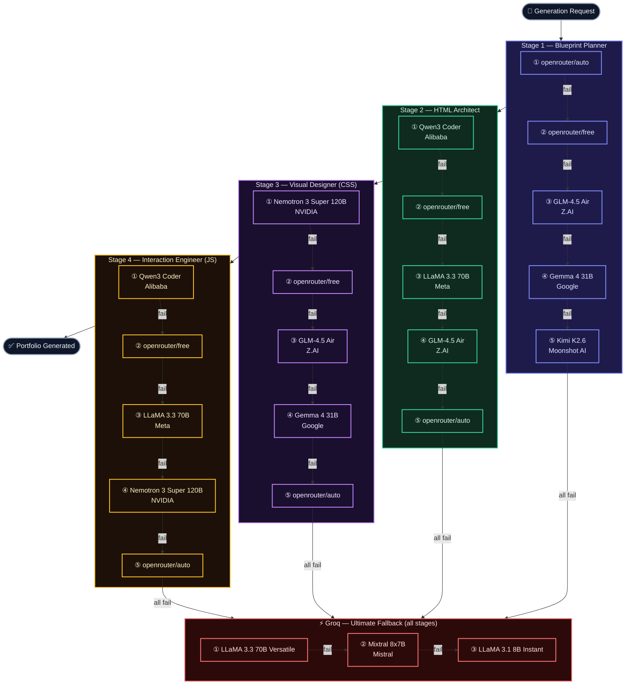

# 🧠 AI Model Pipeline — Profilio

> **How it works:** Each stage tries its models top-to-bottom. On a rate-limit or error, the next model is attempted automatically. If all OpenRouter options are exhausted, Groq takes over as the ultimate fallback — ensuring zero downtime.
