# 🤖 Multiagent System Architecture — AI Based Portfolio Generator

## Overview

This diagram shows the full AI orchestration pipeline — from user input through 4 specialized AI agents down to the final compiled portfolio. Every agent has a primary model and a cascading fallback chain with circuit-breaker health tracking.

---

## System Architecture Diagram

```mermaid
flowchart TD
    %% ── USER ENTRY POINTS ──────────────────────────────────────────────
    subgraph CLIENT["🖥️  Client Layer"]
        UI["React Frontend\n(Vite)"]
        RESUME["📄 Resume Upload\nPDF / DOCX / Image"]
        MANUAL["✏️ Manual Form\nInput"]
        EDIT["🔧 AI Edit Prompt\n(modify-portfolio)"]
    end

    %% ── API GATEWAY ────────────────────────────────────────────────────
    subgraph SERVER["⚙️  Express.js API Server"]
        GW["REST API Gateway\n(index.js + Routes)"]
        AUTH["🔒 Auth Middleware\nJWT + Passport.js"]
        RATELIMIT["🚦 Rate Limiter\n& Concurrency Guard\n(activeGenerations Map)"]
    end

    %% ── AGENT 0: RESUME PARSER ─────────────────────────────────────────
    subgraph AGENT0["🤖 Agent 0 — Resume Intelligence"]
        direction TB
        PDF_EXT["PDF Text Extractor\n(pdf-parse)"]
        DOCX_EXT["DOCX Extractor\n(mammoth)"]
        OCR["🔍 OCR Engine\n(tesseract.js)"]
        LINK_EXT["🔗 Hyperlink Extractor\n(unpdf + regex binary scan)"]
        PARSE_AI["AI Resume Parser\nGroq / OpenRouter\n(Blueprint Layer)"]
        POST_PROC["Post-Processor\n• Social link ground-truth override\n• Skill flattening\n• JSON cleanup"]
        STRUCT_DATA["📦 Structured Profile JSON\n{ personalInfo, skills,\nexperience, projects, education }"]
        PDF_EXT --> LINK_EXT --> PARSE_AI
        DOCX_EXT --> PARSE_AI
        OCR --> PARSE_AI
        PARSE_AI --> POST_PROC --> STRUCT_DATA
    end

    %% ── AGENT 1: BLUEPRINT PLANNER ─────────────────────────────────────
    subgraph AGENT1["🤖 Agent 1 — Blueprint Planner\n(Stage 1: Content Planning)"]
        direction TB
        BP_STATIC["Static Blueprint Generator\n(instant, deterministic)"]
        BP_OUT["🗺️ Blueprint Object\n{ portfolioTone, heroSection,\nvisualPersonalization, themeTweaks }"]
        BP_MODELS["Model Chain:\n① openrouter/auto\n② openrouter/free\n③ z-ai/glm-4.5-air:free\n④ google/gemma-4-31b-it:free\n⑤ moonshotai/kimi-k2.6:free"]
        BP_STATIC --> BP_OUT
    end

    %% ── AGENT 2: HTML ARCHITECT ─────────────────────────────────────────
    subgraph AGENT2["🤖 Agent 2 — HTML Architect\n(Stage 2: HTML Architecture)"]
        direction TB
        HTML_COMPILE["Profilio V1 Compiler\n(profilioV1Compiler.js)\nDeterministic Template Engine"]
        HTML_OUT["📄 Semantic HTML\n+ Tailwind CSS Classes\n+ Dynamic Section Injection"]
        HTML_MODELS["Model Chain (AI edits only):\n① qwen/qwen3-coder:free\n② openrouter/free\n③ meta-llama/llama-3.3-70b:free\n④ z-ai/glm-4.5-air:free\n⑤ openrouter/auto"]
        HTML_COMPILE --> HTML_OUT
    end

    %% ── AGENT 3: VISUAL DESIGNER ────────────────────────────────────────
    subgraph AGENT3["🤖 Agent 3 — Visual Designer\n(Stage 3: Premium CSS)"]
        direction TB
        CSS_GEN["CSS Code Gen Pipeline\n(codeGenPipeline.js)"]
        CSS_OUT["🎨 Premium CSS\n• @keyframes animations\n• Glassmorphism effects\n• Gradient systems\n• Custom fonts"]
        CSS_MODELS["Model Chain:\n① nvidia/nemotron-3-super-120b:free\n② openrouter/free\n③ z-ai/glm-4.5-air:free\n④ google/gemma-4-31b-it:free\n⑤ openrouter/auto"]
        CSS_GEN --> CSS_OUT
    end

    %% ── AGENT 4: INTERACTION ENGINEER ──────────────────────────────────
    subgraph AGENT4["🤖 Agent 4 — Interaction Engineer\n(Stage 4: JavaScript)"]
        direction TB
        JS_GEN["JS Code Gen Pipeline\nVanilla JS / Zero-dependency"]
        JS_OUT["⚡ Interaction JS\n• Scroll animations\n• Theme toggle\n• Accordion menus\n• GitHub calendar"]
        JS_MODELS["Model Chain:\n① qwen/qwen3-coder:free\n② openrouter/free\n③ meta-llama/llama-3.3-70b:free\n④ nvidia/nemotron-3-super-120b:free\n⑤ openrouter/auto"]
        JS_GEN --> JS_OUT
    end

    %% ── ORCHESTRATION ENGINE ────────────────────────────────────────────
    subgraph ORCH["🧠 Orchestration Engine (openrouter.js)"]
        direction TB
        EDIT_ROUTER["🔀 Edit Router\n(selectModelsForEditType)\nRoutes by keyword analysis:\n• layout → HTML_MODELS\n• color/style → CSS_MODELS\n• scroll/click → JS_MODELS\n• default → BLUEPRINT_MODELS"]
        HEALTH["🩺 Model Health Tracker\n• Circuit Breaker Pattern\n• 5-min cooldown on 429/503\n• modelCooldowns Map\n• Key: model + API key"]
        PRIORITY["📊 Priority Scheduler\n(getPrioritizedModelList)\nHealthy models first,\ncooling models as backstops"]
        BENCH["📈 Benchmark Logger\n(benchmarkLogger.js)\nTracks: provider, model,\nlayer, duration, success"]
        EDIT_ROUTER --> HEALTH --> PRIORITY
        PRIORITY --> BENCH
    end

    %% ── AI PROVIDERS ────────────────────────────────────────────────────
    subgraph PROVIDERS["☁️  AI Provider Layer"]
        OR["OpenRouter API\n(openrouter.ai)\n• Free tier routing\n• 15s timeout\n• JSON mode support"]
        NVIDIA["NVIDIA NIM API\n(nvidiaProvider.js)\n• Nemotron 120B\n• Direct inference"]
        GROQ["⚡ Groq API\n(ULTIMATE FALLBACK)\n① llama-3.3-70b-versatile\n② mixtral-8x7b-32768\n③ llama-3.1-8b-instant"]
        OR -->|"rate limit / error"| GROQ
        NVIDIA -->|"rate limit / error"| GROQ
    end

    %% ── EXTERNAL DATA AGENTS ────────────────────────────────────────────
    subgraph EXTERNAL["🌐 External Data Enrichment Agents"]
        GH_AGENT["GitHub Data Agent\n(developerDataService.js)\n• Profile avatar\n• Pinned repos\n• Stars & forks\n• Languages"]
        LC_AGENT["LeetCode Data Agent\n(developerDataService.js)\n• Total solved count\n• Easy/Medium/Hard split\n• Global ranking\n• Acceptance rate"]
        GH_API["GitHub REST API\ngithub.com/users/{username}"]
        LC_API["LeetCode GraphQL API\nleetcode.com/graphql"]
        GH_AGENT --> GH_API
        LC_AGENT --> LC_API
    end

    %% ── ASSEMBLER ───────────────────────────────────────────────────────
    subgraph ASSEMBLER["🏗️  Portfolio Assembler (assemblePortfolio.js)"]
        ASSEMBLE["Combine HTML + CSS + JS\ninto full document\n• Inject CDN links (Tailwind, Devicons)\n• Wrap in base HTML shell\n• Apply theme variables\n• Inject Google Fonts"]
        SPLICE["Section Splicer\n(spliceSectionHtml)\nFor targeted section updates\nwithout full re-generation"]
        ASSEMBLE --> SPLICE
    end

    %% ── PERSISTENCE ─────────────────────────────────────────────────────
    subgraph DB["🗄️  Data Layer"]
        MONGO["MongoDB Atlas\n(Mongoose ODM)"]
        PROJECT["Project Model\n• generatedCode { html, css, js }\n• generationPhase tracker\n• blueprint config\n• content (parsed resume data)"]
        MONGO --> PROJECT
    end

    %% ── FINAL OUTPUT ────────────────────────────────────────────────────
    subgraph OUTPUT["🚀  Output"]
        PREVIEW["Live Portfolio Preview\n(fullPreviewHtml)"]
        DEPLOY["One-click Deploy\n(Vercel / Netlify)"]
        PREVIEW --> DEPLOY
    end

    %% ── FLOW CONNECTIONS ────────────────────────────────────────────────

    %% Client → Server
    UI --> GW
    RESUME --> AGENT0
    MANUAL --> STRUCT_DATA
    EDIT --> RATELIMIT

    %% Server pipeline
    GW --> AUTH --> RATELIMIT --> AGENT1

    %% Agent 0 output feeds blueprint
    STRUCT_DATA --> AGENT1
    STRUCT_DATA --> EXTERNAL

    %% External data enrichment
    GH_AGENT --> AGENT2
    LC_AGENT --> AGENT2

    %% Sequential generation pipeline
    AGENT1 --> AGENT2
    AGENT2 --> AGENT3
    AGENT3 --> AGENT4

    %% All agents use orchestrator
    AGENT1 -.->|uses| ORCH
    AGENT2 -.->|uses| ORCH
    AGENT3 -.->|uses| ORCH
    AGENT4 -.->|uses| ORCH

    %% Orchestrator → Providers
    ORCH --> PROVIDERS

    %% Edit routing
    RATELIMIT -->|"edit request"| EDIT_ROUTER

    %% Agents → Assembler
    AGENT4 --> ASSEMBLER
    ASSEMBLER --> DB

    %% DB → Output
    PROJECT --> PREVIEW

    %% Styling
    classDef agentStyle fill:#1e1b4b,stroke:#6366f1,stroke-width:2px,color:#e0e7ff
    classDef providerStyle fill:#0f2810,stroke:#22c55e,stroke-width:2px,color:#dcfce7
    classDef clientStyle fill:#1c1917,stroke:#78716c,stroke-width:2px,color:#e7e5e4
    classDef serverStyle fill:#1a1a2e,stroke:#3b82f6,stroke-width:2px,color:#bfdbfe
    classDef orchStyle fill:#27111c,stroke:#f43f5e,stroke-width:2px,color:#ffe4e6
    classDef externalStyle fill:#0c1a1a,stroke:#06b6d4,stroke-width:2px,color:#cffafe
    classDef outputStyle fill:#071a0d,stroke:#4ade80,stroke-width:2px,color:#dcfce7
    classDef dbStyle fill:#1c1008,stroke:#f59e0b,stroke-width:2px,color:#fef3c7

    class AGENT0,AGENT1,AGENT2,AGENT3,AGENT4 agentStyle
    class PROVIDERS,OR,NVIDIA,GROQ providerStyle
    class CLIENT,UI,RESUME,MANUAL,EDIT clientStyle
    class SERVER,GW,AUTH,RATELIMIT serverStyle
    class ORCH,EDIT_ROUTER,HEALTH,PRIORITY,BENCH orchStyle
    class EXTERNAL,GH_AGENT,LC_AGENT,GH_API,LC_API externalStyle
    class OUTPUT,PREVIEW,DEPLOY outputStyle
    class DB,MONGO,PROJECT,ASSEMBLER,ASSEMBLE,SPLICE dbStyle
```

---

## Agent Responsibilities Summary

| Agent | Role | Primary Model | Layer |
|-------|------|---------------|-------|
| **Agent 0** | Resume Intelligence | Groq Blueprint | Resume Parsing |
| **Agent 1** | Blueprint Planner | openrouter/auto → glm-4.5-air → Kimi K2 | Content Planning |
| **Agent 2** | HTML Architect | qwen3-coder → llama-3.3-70b → glm-4.5-air | HTML Generation |
| **Agent 3** | Visual Designer | nemotron-3-super-120b → glm-4.5-air | Premium CSS |
| **Agent 4** | Interaction Engineer | qwen3-coder → llama-3.3-70b → nemotron | JavaScript |

## Key System Properties

- **🔀 Intelligent Edit Routing** — `selectModelsForEditType()` performs keyword analysis on user prompts and dispatches to the correct AI layer automatically
- **🩺 Circuit Breaker Pattern** — Failed models are placed on a 5-minute cooldown per API key, preventing cascading delays
- **⚡ Deterministic Fast Path** — The `profilioV1Compiler.js` compiles pixel-perfect portfolios in ~40ms without LLM calls for the initial generation
- **🌐 Data Enrichment** — GitHub and LeetCode APIs are fetched concurrently via `developerDataService.js` and merged into the template
- **🔒 Concurrency Guard** — The `activeGenerations` Map prevents duplicate concurrent AI generations per project
- **📈 Full Observability** — Every model call is benchmarked and logged with provider, model, layer, duration, and success metrics
