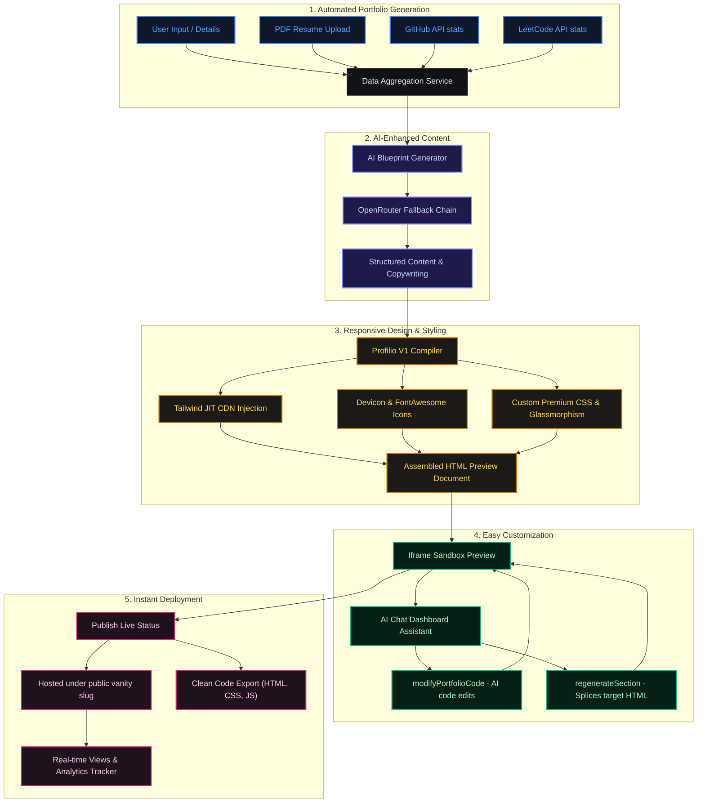

# Profilio | Product Feature Workflow Diagram

This document presents a structured workflow illustrating how Profilio's core value propositions are powered under the hood by our codebase architecture.

---

## E2E Feature Workflow Diagram

---

## Detailed Mapping: Features to Codebase Components

| Feature | Backend Component / File | Description |
| :--- | :--- | :--- |
| **1. Automated Portfolio Generation** | [developerDataService.js](file:///d:/My%20Projects/AI%20Based%20Portfolio%20Generator/server/services/developerDataService.js) & `parseResume` | Aggregates developer data by combining profile details with parallel live stats fetches (GitHub repositories, LeetCode status) and parsing uploaded PDF resumes. |
| **2. AI-Enhanced Content** | [aiController.js](file:///d:/My%20Projects/AI%20Based%20Portfolio%20Generator/server/controllers/aiController.js) | Leverages LLMs (via OpenRouter fallback sequence) to construct a portfolio blueprint, write tailored copy, list skills, and suggest improvements. |
| **3. Responsive Design** | [codeGenPipeline.js](file:///d:/My%20Projects/AI%20Based%20Portfolio%20Generator/server/controllers/codeGenPipeline.js) & [assemblePortfolio.js](file:///d:/My%20Projects/AI%20Based%20Portfolio%20Generator/server/controllers/assemblePortfolio.js) | Compiles HTML, Custom CSS, and JS. Injects FontAwesome, Devicons, Tailwind JIT CDN, and custom animations/scrollbar styles to ensure the page is responsive and modern. |
| **4. Easy Customization** | `modifyPortfolioCode` & `regenerateSection` | Allows users to customize the design or structure. Features include an interactive AI chat interface for code revisions and a precise regex-splicer (`spliceSectionHtml`) that regenerates specific sections without affecting the rest of the site. |
| **5. Instant Deployment** | [projectController.js](file:///d:/My%20Projects/AI%20Based%20Portfolio%20Generator/server/controllers/projectController.js) | Toggles the project to `"Live"` status, making it instantly served via the platform's public vanity routes. Tracks real-time page views and allows download/export of clean, dependency-free HTML/CSS/JS source files. |
