# System Architecture — AI Based Portfolio Generator

```mermaid
flowchart LR
    %% ── INPUT ───────────────────────────────────────────────────────────
    subgraph INPUT["📥 Input"]
        A1["📄 Resume\nPDF / DOCX / Image"]
        A2["✏️ Manual\nForm Entry"]
    end

    %% ── RESUME PARSER ───────────────────────────────────────────────────
    subgraph PARSE["🤖 Agent 0\nResume Intelligence"]
        B1["OCR + Text\nExtraction"]
        B2["AI Parser\n→ Structured JSON"]
    end

    %% ── ORCHESTRATION ───────────────────────────────────────────────────
    subgraph ORCH["🧠 Orchestration Engine"]
        C1["Edit Router"]
        C2["Circuit Breaker\n& Model Health"]
        C1 --> C2
    end

    %% ── AI PIPELINE ─────────────────────────────────────────────────────
    subgraph PIPELINE["⚡ 4-Stage AI Generation Pipeline"]
        direction TB
        D1["🤖 Agent 1\nBlueprint Planner\n— Portfolio Structure"]
        D2["🤖 Agent 2\nHTML Architect\n— Semantic Markup"]
        D3["🤖 Agent 3\nVisual Designer\n— Premium CSS"]
        D4["🤖 Agent 4\nInteraction Engineer\n— JavaScript"]
        D1 --> D2 --> D3 --> D4
    end

    %% ── AI PROVIDERS ────────────────────────────────────────────────────
    subgraph AI["☁️ AI Providers"]
        E1["OpenRouter\n(Free Tier Models)"]
        E2["NVIDIA NIM\n(Nemotron 120B)"]
        E3["Groq\n(Ultimate Fallback)"]
    end

    %% ── ENRICHMENT ──────────────────────────────────────────────────────
    subgraph ENRICH["🌐 Data Enrichment"]
        F1["GitHub API\nRepos + Stats"]
        F2["LeetCode API\nSolving Stats"]
    end

    %% ── BACKEND ─────────────────────────────────────────────────────────
    subgraph BACKEND["⚙️ Backend"]
        G1["Express.js\nREST API"]
        G2["MongoDB Atlas\nProject Storage"]
        G1 --> G2
    end

    %% ── OUTPUT ──────────────────────────────────────────────────────────
    subgraph OUTPUT["🚀 Output"]
        H1["Portfolio\nAssembler"]
        H2["Live Preview\n& Deploy"]
        H1 --> H2
    end

    %% ── CONNECTIONS ─────────────────────────────────────────────────────
    A1 --> PARSE --> B2
    A2 --> B2
    B2 --> PIPELINE
    B2 --> ENRICH
    ENRICH --> PIPELINE
    PIPELINE -.->|"routes through"| ORCH
    ORCH --> AI
    PIPELINE --> H1
    G1 --> PIPELINE
    H1 --> G2
    G2 --> H2

    %% ── STYLES ──────────────────────────────────────────────────────────
    classDef agent fill:#1e1b4b,stroke:#818cf8,stroke-width:2px,color:#e0e7ff,font-weight:bold
    classDef provider fill:#052e16,stroke:#4ade80,stroke-width:2px,color:#dcfce7
    classDef io fill:#1c1917,stroke:#a8a29e,stroke-width:2px,color:#e7e5e4
    classDef orch fill:#2d0a1e,stroke:#f472b6,stroke-width:2px,color:#fce7f3
    classDef enrich fill:#0c1a2e,stroke:#38bdf8,stroke-width:2px,color:#e0f2fe
    classDef backend fill:#1c1008,stroke:#fbbf24,stroke-width:2px,color:#fef3c7
    classDef output fill:#052e16,stroke:#34d399,stroke-width:2px,color:#d1fae5

    class PARSE,PIPELINE,D1,D2,D3,D4 agent
    class AI,E1,E2,E3 provider
    class INPUT,A1,A2 io
    class ORCH,C1,C2 orch
    class ENRICH,F1,F2 enrich
    class BACKEND,G1,G2 backend
    class OUTPUT,H1,H2 output
```

---

### How it works — in one line per layer

| Layer | What it does |
|---|---|
| **Input** | Accepts resume files (PDF/DOCX/Image) or manual form data |
| **Agent 0** | OCR + AI extracts structured profile JSON from resume |
| **Agent 1** | Plans portfolio tone, layout style & visual blueprint |
| **Agent 2** | Generates semantic HTML using the deterministic compiler |
| **Agent 3** | Adds premium CSS — animations, gradients, glassmorphism |
| **Agent 4** | Injects vanilla JS — scroll effects, themes, interactivity |
| **Enrichment** | Pulls live GitHub repos & LeetCode stats via public APIs |
| **Orchestration** | Routes AI calls, tracks model health, handles fallbacks |
| **Output** | Assembles full HTML document → live preview → deploy |
